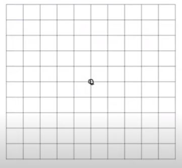
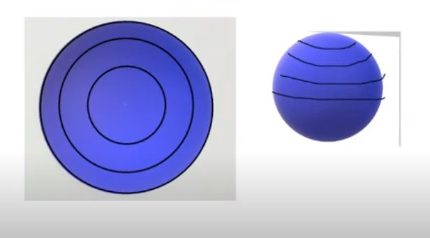
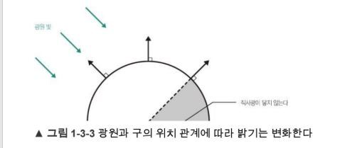

# Meshes

## 240105

### 0. 공통사항

1. `VertexTextureNormal` 구조를 기반으로 vertex의 data 할당.
    1. Vertex의 위치정보를 알기 위한 `Vector3 Position`
    2. `Texture`에서 Pixel color 값들을 받기 위한 `Vector2 Uv`
    3. 빛 정보에 따라 Pixel color 값을 조정하기 위한 `Vector3 Normal`(법선 벡터)

2. Vertex에 대한 정보를 `Mesh::Create` 순수 가상함수에서 할당할 것임.(sub class에서)

3. 각 sub class 들의 생성자에서 `Shader`를 받아 super class(`Mesh`) 복사 생성자 호출.

<br>

### 1. [Quad](https://github.com/VaVamVa/DX3D/blob/main/lesson/DirectX11_3D_19/Framework/Meshes/Quad.cpp)

1. NDC 좌표계를 기준으로 `width`, `height`를 두고, 각 점의 위치에 따라 `position` 할당.

2. UV 좌표계를 기준으로 각점의 위치에 다라 `uv` 할당

3. `front` 방향으로 `normal` 할당

4. `position`을 기반으로 시계방향으로 그릴 수 있게 indices 할당.

<br>

### 2. [Cube](https://github.com/VaVamVa/DX3D/blob/main/lesson/DirectX11_3D_19/Framework/Meshes/Cube.cpp)

#### vertices
1. 본디 육면체의 꼭지점은 총 8개인데, vertices를 24개나 찍음.<br>
2. 이는 `Normal Vector`를 정의하기 어려워지기 때문.<br>
    만약 점의 갯수 만큼만 vertex를 가진다면,<br>
    각 vertex에 대한 법선이 모호해짐 (어디서도 직각이 되지 않음)<br>
    따라서 각 면에 대해 vertex들을 할당(6*4) 함으로서, 각 vertex의 법선을 확실하게 정할 수 있게 함.
    - 인접한 두 점이 명확해 졌기에, 외적으로 법선을 구할 수 있게된다.

#### vertex.position
1. NDC 좌표계를 기반으로 `width`, `height`, `depth`를 둔다.
2. 어느 면인지를 생각하며 각 좌표를 배치한다.
    ```
    // 고정값

    Front : -depth
    Back : +depth

    Up : +height
    Down : -height

    Right : +width
    Left : -width
    ```
    - 해당 면의 법선벡터 원소들 중에 "0이 아닌 값"이 고정값.

#### vertex.uv
1. 각 면을 2D의 관점에서 UV 좌표계로 존재하기에, 모든 면이 같은 값을 가짐.
2. position의 위치에 맞게<br>
    UV 좌표계 기준으로 점을 할당<br>
    - 좌하(0,1), 좌상(0,0), 우상(1,0), 우하(1,1)

#### vertex.normal
- 각 면의 법선벡터를 할당.
    - Ex_ `Front`면 (0, 0, -1).

#### indices
- vertices의 index를 기반으로 시계방향으로 그릴 수 있게 할당.
- `pjt`에서는 한 사각형 면 당 "좌하->좌상->우상", "우상->우하->좌하" 의 순으로 polygon 두 개를 그렸음.

<br>

### 3. [Grid](https://github.com/VaVamVa/DX3D/blob/main/lesson/DirectX11_3D_19/Framework/Meshes/Grid.cpp)

#### vertices
1. 정사각형의 형태로 만드는 것이 편함.
2. 단위 정사각형 n*n 개로 그룹 정사각형을 만듦
    - `n == 2k (k는 자연수)` 형태로 만들어야 중앙의 vertex가 생겨서 좋음.
3. 그렇다면 vertex는 총 (n + 1) * (n + 1) 존재

#### vertex.position
1. `면의 갯수 / 2` 가 NDC 좌표계 기준 전체(그룹으로 묶인) 사각형의 `centerX`, `centerY`
    - NDC 좌표계 기준, 단위 사각형 당 너비와 높이를 `1.0f`로 한 것.
2. countX(x 줄 점의 개수), 한 행에 countZ(z 줄 점의 갯수)
3. 한 줄에 점의 갯수를 생각하며, 정 가운데 vertex가 `vertex.Position = Vector3(0,0,0)`이 되도록 위치 설정.
    ```cpp
    position = Vector3((float)x_반복자 - centerX, 0, (float)z_반복자 - centerY)
    ```
    - 가운데 점을 원점(0,0)으로 가로_x 축, 세로_z 축의 2차원 평면이 그려짐
    
    
    
#### vertex.uv
1. `u = 반복자_X / 가로축 점의 개수`, `v = 반복자_Z / 세로축 점의 개수`
2. 후에 `Shader`에서 `Address = Warp`으로 Texture가 한 단위 사각형에 그려지도록 설정 함.
3. `uv_offset`을 두어 `uv`를 별도로 조정할 수 있게 함.

#### vertex.normal
- 모든 면의 법선벡터는 위(`Vector3(0, 1, 0)`)를 바라보게.

#### indices
- 한 사각형에 대한 두 polygon을 1 loop으로 가로*세로 이중 반복.
```cpp
for (uint z = 0; z < countZ - 1; z++)  // 세로 vertex의 갯수
{
    for (uint x = 0; x < countX - 1; x++)  // 가로 vertex의 갯수
    {
        indices.push_back(countX * z + x);  // [index] = countX * z + x                     : 좌하
        indices.push_back(countX * (z + 1) + x);  // [index + 1] = [index] + countX * z     : 좌상
        indices.push_back(countX * z + x + 1);  // [index + 2] = [index] + 1                : 우하

        indices.push_back(countX * z + x + 1);  // [index + 3] = [index + 2]                : 우하
        indices.push_back(countX * (z + 1) + x);  // [index + 4] = [index + 1]              : 좌상
        indices.push_back(countX * (z + 1) + x + 1);  // [index + 5] = [index + 1] + 1      : 우상
    }
}
```

<br>

### 4. [Sphere](https://github.com/VaVamVa/DX3D/blob/main/lesson/DirectX11_3D_19/Framework/Meshes/Sphere.cpp)

아래와 같은 형태로 "양 극점의 원 두개"와 "중간의 사각형 절편들"로 이루어지게끔 vertices를 찍음.<br>


#### 1. North Pole 할당
- `MeshVertex(0, radius, 0, 0, 0, 0, 1, 0)`
    - 순서대로 : position.x, position.y, position.z, uv.x, uv.y, normal.x, normal.y, normal.z
    - y축으로 가장 위(+radius)에 존재하는 점의 position, uv(`(0, 0)` == 시작점), normal(0, +1, 0).

#### 2. 가운데 사각형 절편들

1. 각 선의 간격을 정하기 위한 `stackStep`(전체 위도 선 갯수)과 `sliceStep`(전체 경도 선 갯수)를 멤버 변수로 가진다.
    - 생성자에서 할당 받는다.


2. 선의 간격에 대한 각도를 계산한다.
    ```cpp
    float verticalStep = Math::PI / stackStep;          // 내려갈 때 한번에 이동하는 각도
	float horizontalStep = Math::PI * 2 / sliceStep;    // 회전할 때 한번에 이동하는 각도
    ```

3. 위도(`latitude`)(가로로 그음_행)와 경도(`longitude`)(세로로 그음_열)를 계산한다.
    - 그림의 선은 위도 선 이다.
    - 위도와 경도는 "각도가 얼마나 진행했는 가"를 나타내기 위함이다.
    1. 위도는 y (1차 loop) 반복자에 `verticalStep`을 곱한 값이다.
    2. 경도는 x,z 에 대해서 변하기 때문에 별도의 반복자(Ex_ i)를 두며,<br>
        i (2차 loop) 반복자에 `horizontalStep`을 곱한 값이다.

4. `2`에서 단위 각도를 구했고, `3`에서 진행 정도를 구했기 때문에 좌표(`position`) 계산이 가능하다.
```cpp
Vector3 position = Vector3
(
    (radius * sinf(latitude) * cosf(longitude)),    // x
    (radius * cosf(latitude)),                      // y
    (radius * sinf(latitude) * sinf(longitude))     // z
);
```

5. `uv` 값은 각각 다른 범위의 값이 할당되는데,
    - `u`는 360도 돌려서 찍어야 하기 때문에 `longitude / (Math::PI * 2)`
    - `v`는 세로로 180도 범위에 찍히기 때문에 `latitude / Math::PI`

6. `normal`은 구의 중심에서 각 vertex로 뻗는 방향벡터를 정규화한 값이다.
    - `Normalize(position - Vector3(0, 0, 0))`

#### 3. South Pole 할당
- `MeshVertex(0, -radius, 0, 0, 0, 0, -1, 0)`
    - 순서대로 : position.x, position.y, position.z, uv.x, uv.y, normal.x, normal.y, normal.z
    - y축으로 가장 위(-radius)에 존재하는 점의 position, uv(`(0, 0)` == 시작점), normal(0, -1, 0).

#### 4. indices
1. (북극 원) 북극점을 중심으로 원을 그리는 index를 할당
    - 북극점에 대한 index는 "0"
    - 북극점 인덱스에서 sliceStep만큼 polygon을 그리게끔 index 할당

2. (중간 사각형) 북극점을 제외하고 그 후의 index 할당하기 위한 정수 선언 (`int baseIndex = 1`)

3. (중간 사각형) 각 위도에서 시작점을 `sliceStep + 1`로 잡고, 이 시작점 반복자를 곱해주어 loop에 따라 시작점에서부터 index를 찍도록 구현.

4. (남극 원) 남극점을 중심으로 원을 그리는 index 만들기.
    - 남극점에 대한 index는 `vertices.size() - 1`
    - 남극점 인덱스에서 sliceStep만큼 polygon을 그리게끔 index 할당


<br>

### 5. [Shader](https://github.com/VaVamVa/DX3D/blob/main/lesson/DirectX11_3D_19/_Shaders/07_Mesh.fx)

Mesh 도형을 위한 새로운 Shader 생성

1. `VertexTextureNormal` 구조를 따르는 Vertex에 맞게 Input/Output 구조 생성.
    - `Position` 값은 이전과 동일하게 WVP 순서로 행렬 곱
    - `Uv`는 `input` 값 그대로 이용.
    - `Normal` 값은 `World 행렬`과 곱하여 좌표계 변환.
        - `Normal` 값 변환 시 행렬 곱 형식에 맞추기 위해 `World 행렬`을 3x3 행렬로 type casting.

2. `Texture color` 정보를 `In/Out` 하기 위한 `Texture2D DiffuseMap` 선언
    - <b>(추가 공부 필요)</b>

3. `SamplerState`의 `Filter`, `Address` 타입은 아래와 같이 함.<br>
    ```
    Filter = MIN_MAG_MIP_LINEAR;
    AddressU = Wrap;
    AddressV = Wrap;
    ```

4. `out Pixel Shader` 함수에서 빛에 따른 `Texture pixel color` 변환 구현
    ```cpp
    float3 normal = normalize(input.Normal);
    float3 light = -normalize(LightDirection);
    float halfLabertianValue = 0.05f;

    // saturate == Clamp : min, max 값을 벗어나는 값은 min, max로 고정.
    float NdotL = saturate(dot(normal, light)) + halfLabertianValue; 
    
    // 반환값
    float4 outputResult = DiffuseMap.Sample(LinearSampler, input.Uv) * NdotL;
    ```
    - "비어-램버트 법칙(Beer-Lambert law)"은 물질들이 빛의 흡수과정에서 입사광과 투과광의 강도의 비율은 그 물질의 성질에 따라 비례한다는 것을 보여주는 법칙이다.
        - [나무위키](https://namu.wiki/w/%EB%B9%84%EC%96%B4-%EB%9E%A8%EB%B2%84%ED%8A%B8%20%EB%B2%95%EC%B9%99)
    - 
        - [람베르트_반사식](https://domaindeveloper.tistory.com/5)
    - 위의 구현은 "Half Lambert" 방식으로서, color 값이 0에 수렴하게 될 pixel들에 최소 값을 더하기 하여<br>
    완전히 안보이게 되는 일(`RGB(0, 0, 0)`)을 방지해준 것 이다.

#### (+) `4`에서, `normal` 벡터와 `light` 벡터에 대한 정보들을 정규화(`normalize`)해주는 것에 대하여.

1. light vector가 제일 처음 정의되는 곳을 보자면, `Demo` 객체에서 처음 정의가 되고, 이를 Shader에 전달하게 된다.

2. `shader`에서 정규화를 진행하게 되면, 모든 `view 절두체` 내의 vertices에 대하여 정규화를 진행하게 된다.

3. `2`와 반대로, `Demo` script(CPU)에서 정규화를 하고,<br>
    `shader`에 정규화된 데이터(빛 혹은 법선 벡터)를 넘기면,<br>
    더 적은 연산으로 vertices를 정규화 할 수 있다.

4. 다만 `3`의 경우에도 생각을 해야하는 것이 두 가지 있다.
    1. 모든 개발자들이 무조건 CPU에서 두 벡터에 대한 정규화를 진행해야 한다.<br>
        좀 더 여유로운 개발을 원한다면 `shader`에서<br>
        정규화를 진행하는 것이 편하다.
        - `shader`에서 구현하면 `view 절두체` 내의 모든 vertices에서 연산을 진행하기 때문.
        - 일반적으로 CPU 보다 "후반의" 과정이기 때문에, 연산을 놓칠 일이 적다 생각함.
    2. view-port에 들어오지 않았는데도 정규화 연산을 진행하기 때문에,<br>
        중요하지 않은 오브젝트(상호작용이 딱히 없는 오브젝트 등)에 대해서는<br>
        `shader`에서 정규화 하는 것이 연산량을 줄이는 방법이 될 수 있다.
        - `shader`에서 정규화를 진행할 경우 현재 `view 절두체` 안의 vertices만 연산을 진행하는데 반해,<br>
            CPU에서 정규화를 진행할 경우 모든 객체에 대해 연산을 하기 때문.
        
5. `4`에 대하여, 어떤 방식이든 CPU와 GPU 에서 두번 연산하는 일은 피해야 할 것이다.

### [GameDemo](https://github.com/VaVamVa/DX3D/blob/main/lesson/DirectX11_3D_19/Game/Demo/Mesh/02_MeshDemo.cpp)

1. Rendering할 `Mesh 객체`를 멤버로 가짐.
2. `shader` 가짐
    - `Mesh 객체` 생성시 할당 용도.
    - `shader`에 data 보내기 용도.
3. 빛의 방향에 대한 `Vector3`,<br>
    빛 방향 정보를 shader로 보내줄 `ID3DX11EffectVectorVariable*`
    - 해당 인터페이스의 `SetFloatVector 메서드`를 이용하여 data 전달.